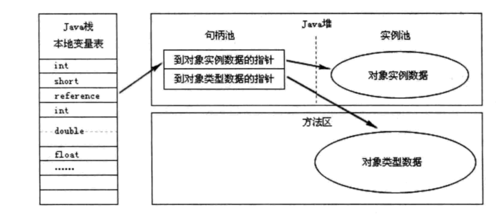
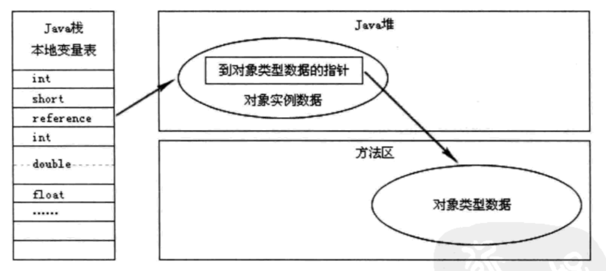

# 一、运行时数据区域
## 1.程序计数器
> 程序计数器是线程私有的，它占用的一块较小的内存区域，他的作用可以看成当前线程所执行的字节码的行号指示器。

## 2.Java虚拟机栈
java虚拟机栈是线程私有的，每一个方法被调用直至执行完成的过程，就对应着一个栈帧在虚拟机栈中从入栈到出栈的过程。

> **栈在内存中对应的结构**
- 线程1
  - 栈帧1
    - 局部变量表（基础类型，对象引用，returnAddress类型）
    - 操作栈
    - 动态链接
    - 方法出口
    - ......
  - 栈帧2
  - ......
- 线程2
- ......

> **异常**

1. 如果线程请求的栈深度大于虚拟机所允许的深度，将抛出StackOverflowError 异常
2. 如果虚拟机栈可以动态扩展（当前大部分的Java虚拟机都可动态扩展，只不过Java虚拟机规范中也允许固定长度的虚拟机栈），当扩展时无法申请到足够的内存时会抛出OutOfMemoryError 异常。

## 3.本地方法栈
> 本地方法栈与java虚拟机栈的作用是类似的，区别就是java虚拟机栈是为java方法提供服务的，而本地方法栈是为native方法提供服务的

## 4.堆
> 堆内存是线程共享的，java虚拟机规范规范描述：所有的实例和数组都需要在堆上分配。

> **堆的结构**
- 新生代
  - Eden空间
  - From Survivor空间
  - To Survivor空间
- 年老代

## 5.方法区
> 方法区是线程共享的，它用于存储已被虚拟机加载的类信息、常量、静态变量等数据。

> Java虚拟机规范对这个区域的限制非常宽松，除了和Java堆一样不需要连续的内存和可以选择固定大小或者可扩展外，还可以选择不实现垃圾收集。相对而言，垃圾收集行为在这个区域是比较少出现的。又称为“永久代”。

# 二、对象访问
## 1.句柄访问

> 如果使用句柄访问方式，Java堆中将会划分出一块内存来作为句柄池，reference中存储就是对象的句柄地址。

## 2.指针访问

> 如果使用直接指针访问对象，Java堆对象的布局中就必须考虑如何放置类型数据的相关信息，reference中直接存储就是对象地址。

- 句柄访问的优点reference中存储的是稳定的句柄地址，在对象移动的时只会改变句柄的实例数据指针，而reference不需要修改。
-  直接指针访问优点是访问对象时速度更快，节省了一次指针定位的时间开销。

