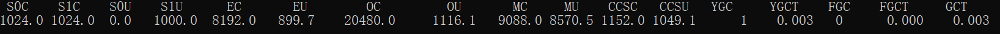

# 一、jvm参数

```
-Xms40m -Xmx40m -Xmn10m -XX:+UseParallelGC -XX:+PrintGCDetails -XX:+PrintGCTimeStamps
```

- -Xms 堆最大值
- -Xmx 堆最小值

- -Xmn 年轻代大小

在[2.自动内存管理机制.md]讲到堆空间分为：

- 新生代        **大小：1/3**
  - Eden空间      大小：**1/3 * 8/10**
  - From Survivor空间   大小：**1/3 * 1/10**
  - To Survivor空间      大小：**1/3 * 1/10**
- 年老代    **大小： 2/3**

# 二、源码测试

源码地址：[GcFullgc.java]( https://github.com/gaozhen1996/study-java/blob/master/study-java-jvm/src/main/java/com/gz/javastudy/jvm/GcFullgc.java )

启动时设置jvm参数

```
-Xms30m -Xmx30m  -XX:+UseParallelGC -XX:+PrintGCDetails -XX:+PrintGCTimeStamps
```

运行jstat 查看内存大小 （单位：字节）

```
jstat -gc  25588  [刷新时间]
```



-   S0C：年轻代第一个survivor的容量    **30M * 1/3 *  1/10  = 1M**
-   S1C：年轻代第二个survivor的容量    **30M * 1/3 *  1/10  = 1M**
-   S0U：年轻代第一个survivor已使用的容量  
-   S1U：年轻代第二个survivor已使用的容量 
-   EC：年轻代中Eden的空间                  **30M * 1/3 *  8/10  = 8M**
-   EU：年代代中Eden已使用的空间 
-  OC：老年代的容量                               **30M * 2/3   = 20M** 
-  OU：老年代中已使用的空间 
-  MC： metaspace(元空间)的容量 
-  MU： metaspace(元空间)目前已使用空间 
-  CCSC：当前压缩类空间的容量 
-  CCSU：当前压缩类空间目前已使用空间 
-  YGC：从应用程序启动到采样时年轻代中gc次数 
-  YGCT：从应用程序启动到采样时年轻代中gc所用时间(s) 
-  FGC：从应用程序启动到采样时old代(全gc)gc次数 
-  FGCT：从应用程序启动到采样时old代(全gc)gc所用时间(s) 
-  GCT：从应用程序启动到采样时gc用的总时间(s) 