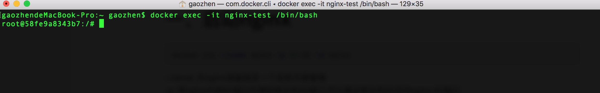
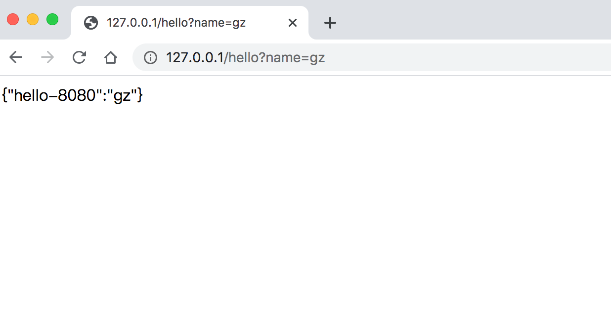
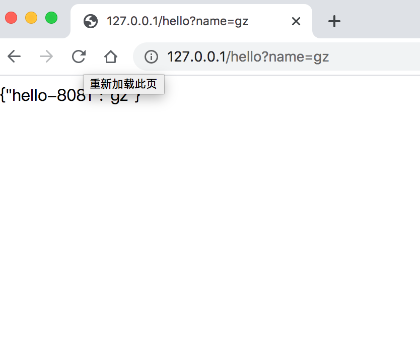

# 一、启动nginx

```bash
docker run --name nginx -p 80:80 -d nginx
```

- -name: 为nginx容器指定一个名称方便管理
- -p: 将nginx内部80端口代理到宿主机80端口,可以通过宿主机80访问nginx 80端口
- -d: 后台运行

# 二、修改nginx配置文件

## 1.进入docker容器

```bash
docker exec -it nginx-test /bin/bash
```



## 2.修改nginx配置文件

```
upstream sellticket{ 
     server 192.168.0.7:8080 weight=1;
     server 192.168.0.7:8081 weight=1;
} 
server {
     listen       80;
     listen  [::]:80;
     server_name  localhost;
     proxy_pass http://sellticket;
}
```

- upstream sellticket 定义集群 weight为权重
- proxy_pass 是配置服务需要访问的地址

**注意：**

因为是从docker容器中访问宿主机的服务，因此需要查询宿主机的IP方可访问，开始我设置的127.0.0.1访问不了。宿主机的IP可以通过ifconfig来获取

# 3. 重启nginx

docker run --name nginx -p 80:80 -v /Users/gaozhen/config-file/nginx/nginx.conf:/etc/nginx/nginx.conf -v /Users/gaozhen/config-file/nginx/log:/var/log/nginx -v /Users/gaozhen/config-file/nginx/conf.d/default.conf:/etc/nginx/conf.d/default.conf -d nginx

- --name: 为nginx容器指定一个名称方便管理
- -p: 将nginx内部80端口代理到宿主机80端口,可以通过宿主机80访问nginx 80端口
- -v :是宿主机的文件映射到docker容器中
- -d: 后台运行

# 4.访问http接口

启动宿主机上springboot服务，请求接口，可以看到8080和8081端口在交替访问







