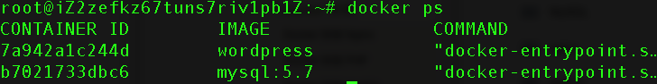

# 1.新建并启动 MySQL 容器。

```
docker container run \

  -d \

  --rm \

  --name wordpressdb \

  --env MYSQL_ROOT_PASSWORD=123456 \

  --env MYSQL_DATABASE=wordpress \

  mysql:5.7
```

**2.基于官方的 WordPress image，新建并启动 WordPress 容器。**

```
docker container run \

  -d \

  -p 0.0.0.0:8081:80 \

  --rm \

  --name wordpress \

  --env WORDPRESS_DB_PASSWORD=123456 \

  --link wordpressdb:mysql \

  --volume "$PWD/wordpress":/var/www/html \

  wordpress
```

