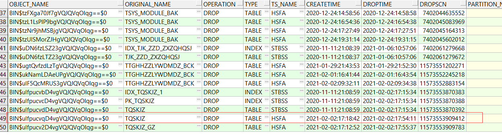
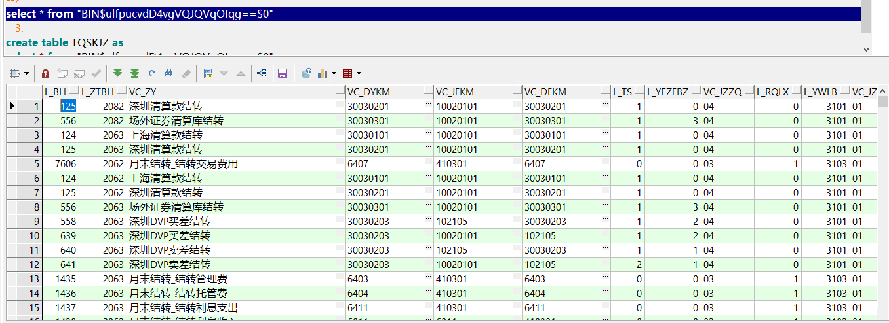

# 1查出在垃圾桶的表名

```
select * from recyclebin
```



# 根据object_name查询表数据

```
select * from "BIN$ulfpucvdD4vgVQJQVqOIqg==$0"
```

**注意加双引号**



# 3恢复表数据

```
create table TQSKJZ as
select * from "BIN$ulfpucvdD4vgVQJQVqOIqg==$0"
```

